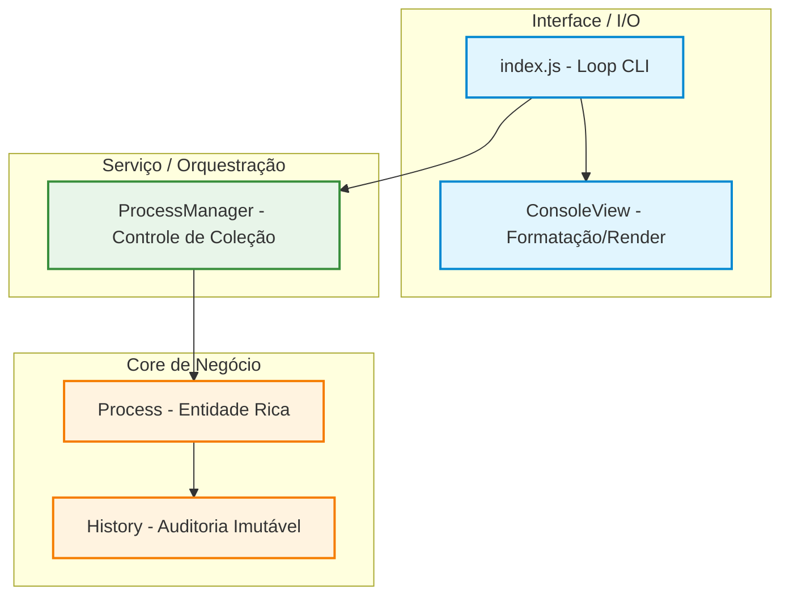

# ProcEngine Enterprise CLI

<div align="center">
  
  
  
</div>

<br />

> **ProcEngine Enterprise CLI** é um simulador minimalista e robusto de um motor de gerenciamento de processos de negócios (BPM) via linha de comando. O projeto expõe domínio avançado de **JavaScript puro (ES6+ ES Modules)**, modelagem de domínio rica, encapsulamento estrito e separação clara de responsabilidades (SOLID).

---

## Arquitetura do Software

A estrutura do projeto foi concebida sob o padrão de **Separação de Responsabilidades (SoC)**, dividida em três camadas fundamentais:



### Detalhamento das Camadas

1. **Apresentação (UI Layer):**
   - `ConsoleView`: Responsável estritamente pela formatação de saída e cores no console.
   - `index.js`: Gerencia o fluxo de entrada (`readline`) e o loop de eventos da interface. **Zero lógica de negócios reside aqui.**
2. **Aplicação (Application Layer):**
   - `ProcessManager`: Atua como o caso de uso e orquestrador do sistema. Gerencia a coleção de processos ativos, calcula métricas gerais e executa filtros transversais.

3. **Domínio (Domain Layer):**
   - `Process`: Entidade rica que encapsula o ciclo de vida do processo, contendo regras de mutação de status e geração de SLA.
   - `History`: Value object imutável que registra de forma atômica e auditável toda transição de estado do sistema.

---

## 💡 Diferenciais Técnicos & Padrões Aplicados

- **Encapsulamento Estrito (Private Fields):** Uso do prefixo nativo `#` do JavaScript (`#id`, `#status`) nas entidades de domínio. O estado interno só pode ser alterado através de métodos controlados do próprio objeto, impossibilitando mutações externas inválidas.
- **Imutabilidade de Coleções:** Para blindar o estado interno contra referências indesejadas, propriedades como `processes` e `listHistory` retornam cópias superficiais (_shallow copies_) usando o operador spread (`[...]`).
- **Máquina de Estados & Auditoria (Audit Trail):** Toda alteração de estado exige validação rígida e a obrigação de uma justificativa textual. Isso gera um registro instantâneo (`History`) com timestamp ISO, simulando um motor BPM corporativo.
- **Motor de SLA Inteligente:** O prazo limite é calculado de forma atômica na criação com base na prioridade:
  - **ALTA**: 1 dia (24h)
  - **MÉDIA**: 3 dias (72h)
  - **BAIXA**: 5 dias (120h)

---

## 🚀 Como Executar

### Pré-requisitos

- **Node.js v18.0.0+** (para suporte às propriedades privadas `#` e a API `crypto.randomUUID()`).

### Inicialização rápida

```bash
# Clone e entre no diretório
cd procengine-cli-js

# Inicie o motor
npm start
```

---

## 📞 Contato & Redes Sociais

- **Autor:** Rhuan Kowic Santos
- **GitHub:** [github.com/rhuan-kowic](https://github.com/rhuan-kowic)
- **LinkedIn:** [https://www.linkedin.com/in/rhuan-kowic-santos/](https://www.linkedin.com/in/rhuan-kowic-santos/)
